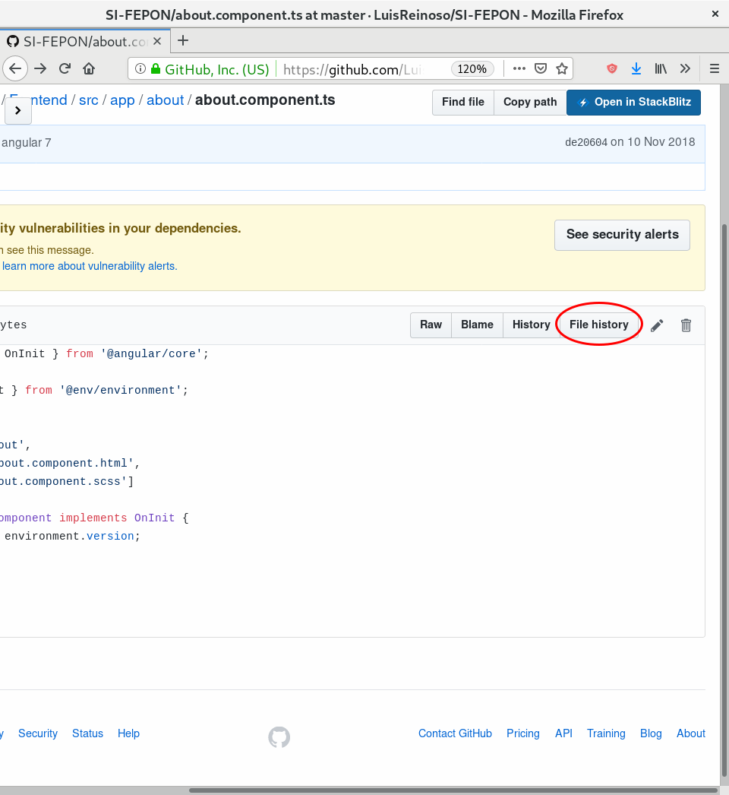
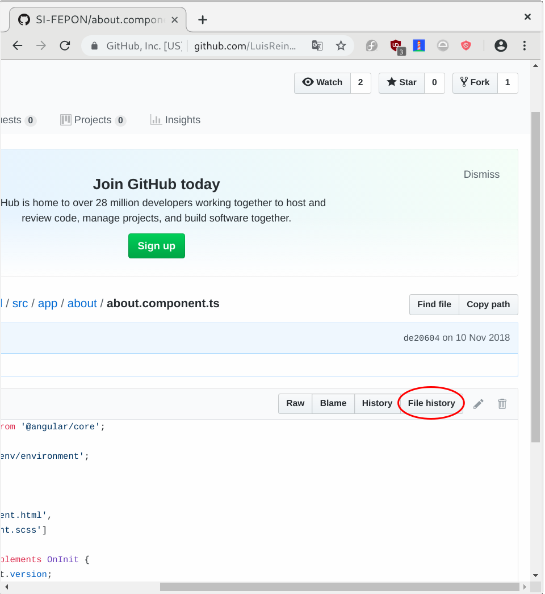

# Github History Browser Extension
Esta extensión de navegador añade un botón (cuando visitas un archivo en github.) para que cuando lo presiones automaticamente te redirija a [https://github-history.netlify.com/](https://github-history.netlify.com/)
Aprende del pasado viendo los cambios en los archivos de los proyectos de github.

## Instalación
**Firefox**: [https://addons.mozilla.org/es/firefox/addon/github-history/](https://addons.mozilla.org/es/firefox/addon/github-history/)

## Firefox

## Chrome

## Agradecimientos

- https://github.com/pomber/github-history

