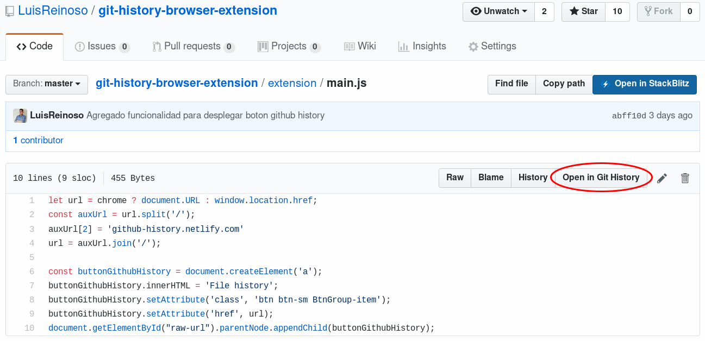

# Git History Browser Extension
Esta extensión de navegador añade un botón (cuando visitas un archivo en github.) para que cuando lo presiones automáticamente te redirija a [https://github.githistory.xyz/](https://github.githistory.xyz/)
Aprende del pasado viendo los cambios en los archivos de los proyectos de github.

### Instalación
**Firefox**: [https://addons.mozilla.org/es/firefox/addon/github-history/](https://addons.mozilla.org/es/firefox/addon/github-history/)

**Chrome**: [https://chrome.google.com/webstore/detail/github-history-browser-ex/laghnmifffncfonaoffcndocllegejnf](https://chrome.google.com/webstore/detail/github-history-browser-ex/laghnmifffncfonaoffcndocllegejnf)

### Captura

### Agradecimientos

- https://github.com/pomber/github-history

